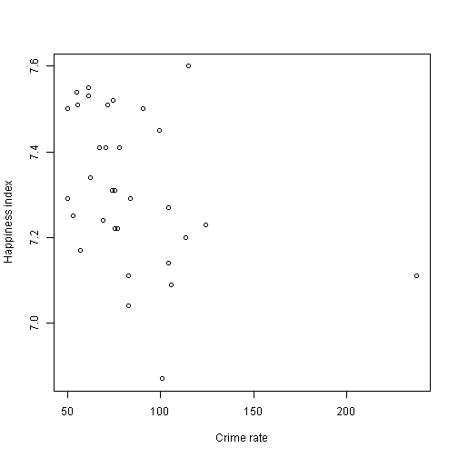

Happiness and crime
========================================================
author: Francisco Marco-Serrano
date: 19/06/2015

Variables related to happiness
========================================================

Using data from London boroughs we can assess the variables related to happiness.
Mainly, variables related to:

- Income and wealth
- Employment
- Safety

Happiness and crime rate (scattergram)
========================================================

 


Happiness and crime rate (regression)
========================================================


```r
lm(df$Happiness.score ~ df[, 9])
```

```

Call:
lm(formula = df$Happiness.score ~ df[, 9])

Coefficients:
(Intercept)      df[, 9]  
   7.473339    -0.001866  
```


Conclusions
========================================================
There is a negative relationship between crime rates and happiness.

However, we have to consider this results have many limitations and the analysis has been very limited, only for demo purposes.
